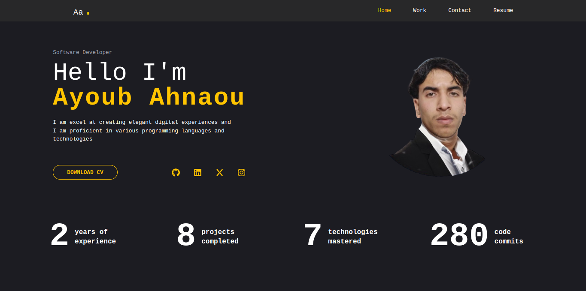

# AYOUB AHNAOU | PORTFOLIO

## Description

This portfolio project showcases my skills, projects, and experiences as a software developer. it includes various projects I have worked on, my resume, and contact information.

## Overview

## Feature

* **Home page**: Overview of my skills and a brief introduction.

* **Projects**: A gallery of my projects with descriptions and links to their repositries.

* **Resume**: A downloadable version of my resume.

* **Contact**: A form for visitors to send me messages.

## Technologies used

* HTML5
* TailwindCSS
* JavaScript (ES6)
* React
* Node.js
* Git
* Gitub

## Contact

You can reach me at:
* **Email**: ayoubahnaou@gmail.com
* **Linkedin**: <a href="" target="_blank">Linkedin</a>
* **GitHub**: <a href="https://www.github.com/ayuuub-90" target="_blank">GitHub</a>

<!-- TODO: Include icons and links to your RELEVANT, PROFESSIONAL 'DEV-ORIENTED' social media. LinkedIn and dev.to are minimum. -->

